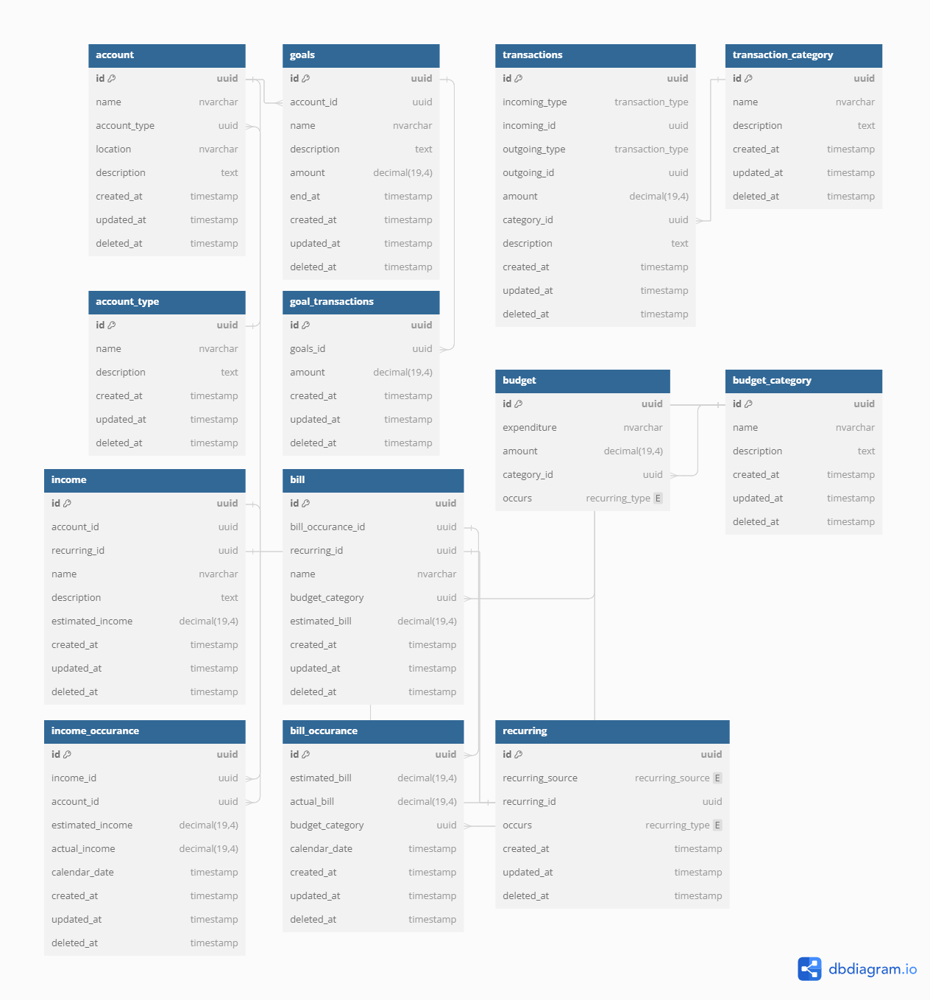

# Project Features

Taken from the [DeepPockets: MVP Feature Selection!](https://www.youtube.com/watch?v=vv1J8kQkkac) video.
Discussed between 50:15 - 1:20:40

[Schema below](#dbdiagram-header)

## Budgets

    • Line Items
    	○ Income
    	○ Expenditures
    	○ Categorized
    		§ Housing
    		§ Auto
    		§ Health
    		§ Education
    		§ Debt
    		§ Some Static, some user created
    • Monthly
    • Duplicable
    • Adjustable
    • Create New

## Transactions

    • Income (Credit)
    	○ Add New Income
    	○ Auto add automated payments
    	○ Delete / Alter
    • Expense (Debit)
    	○ Add New Expense
    	○ Auto add automated payments
    	○ Delete / Alter

## Accounts

    • User Created
    	○ Types
    		§ Static Types (savings, checking, credit card)
    		§ Create their own
    	○ Goals
    		§ User created
    		§ Name
    		§ Amount
    		§ End Date
    	○ Updated based on the income and expenditures (transactions)

## Views

    • Basic Budget View
    • Budgets View, Shows amount spent and amount available
    • Upcoming Bills (expenses) List (by week / month)
    • Calendar View
    • Savings Goal Chart
    • Debt Reduction Chart (Goals)
    • Search / Filter on Expenses
    	○ By timeframe
    	○ By category
    	○ By expense line item
    	○ Over time

## Notifications

    • None external
    • Form Errors
    • Visual alerts for overdue

###  DB Diagram

[Link to DB Diagram](https://dbdiagram.io/d/Deep_Pockets_MVP_Finalized_Features-66237fbe03593b6b617dced4)

