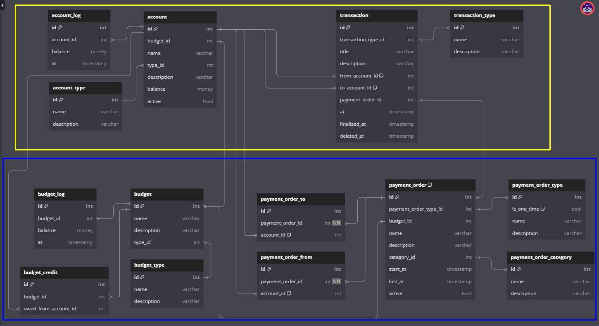

# Here is my database schema.

You can find the diagram [here](https://dbdiagram.io/d/DP-660b4a1a37b7e33fd740cea8)

# Explanation

Each budget has at least one dedicated account to store money. 
There are different types of budget (regular, goal, etc.)

Account keeps money and can belong to only budget.
There are different types of accounts (debit, credit)

Transaction can be spending, earning, transfer between accounts.
There are different types of transaction for each purpose.
Transaction can be changed, info about changes is kept in dedicated table.

Scheduled transaction is planned automatic (weekly, biweekly, etc.) transaction
or single planned transaction.

There are `account_log` and `budget_log` to keep track of changes.
Maybe there should be a dedicated table for transferring account between budgets.